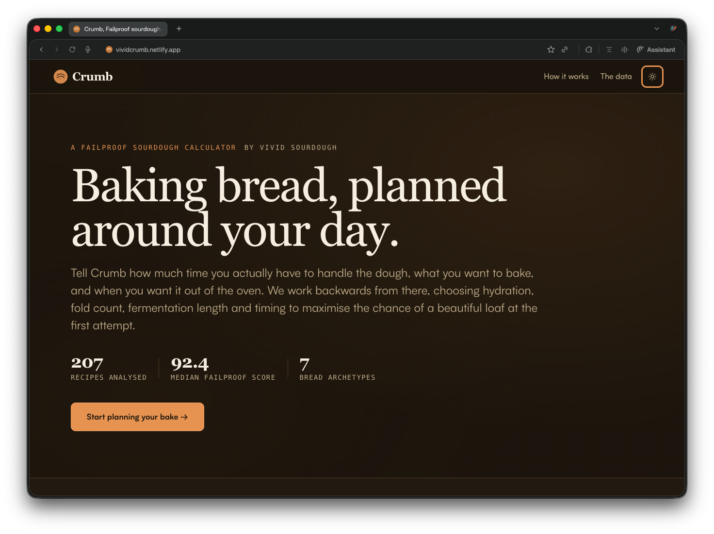
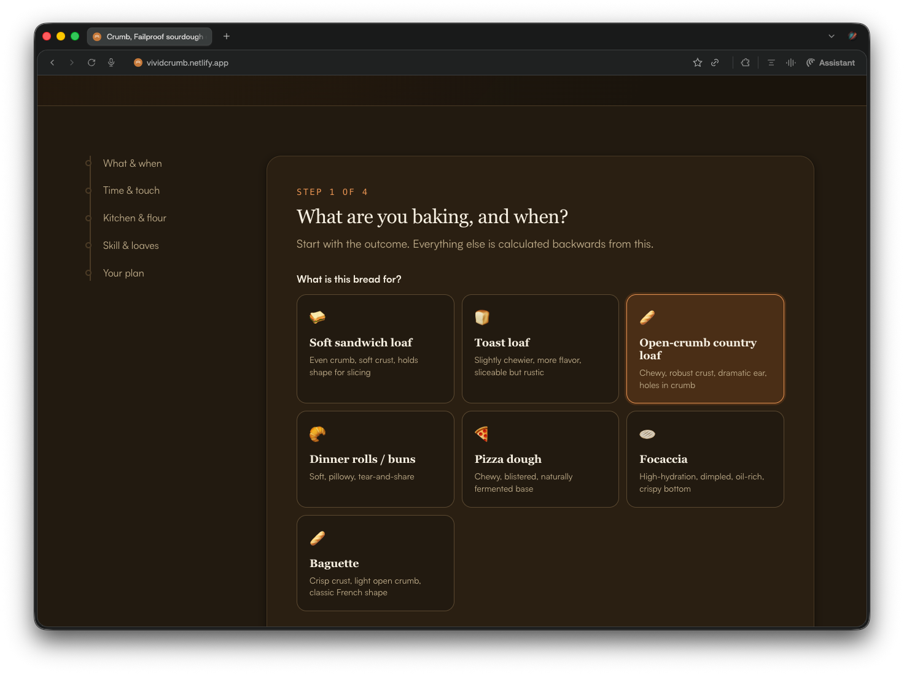
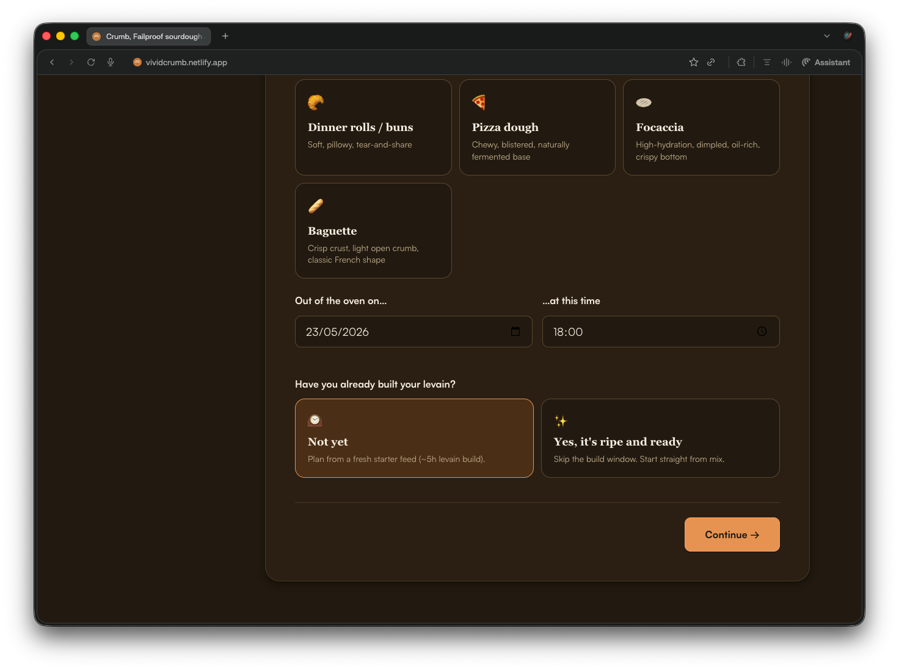
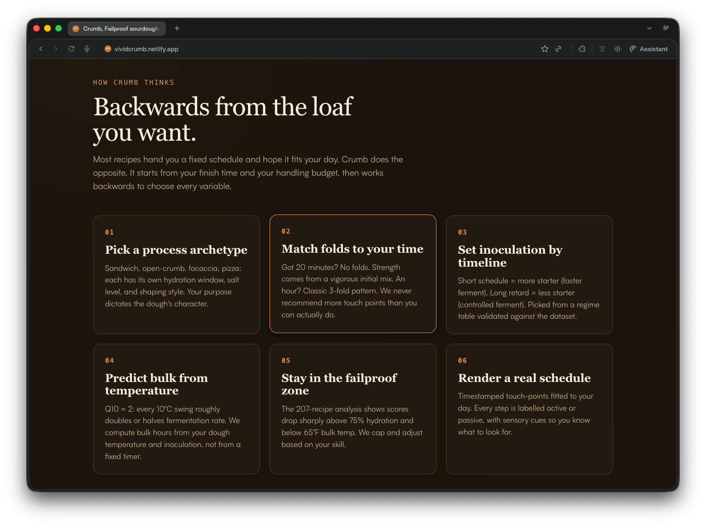
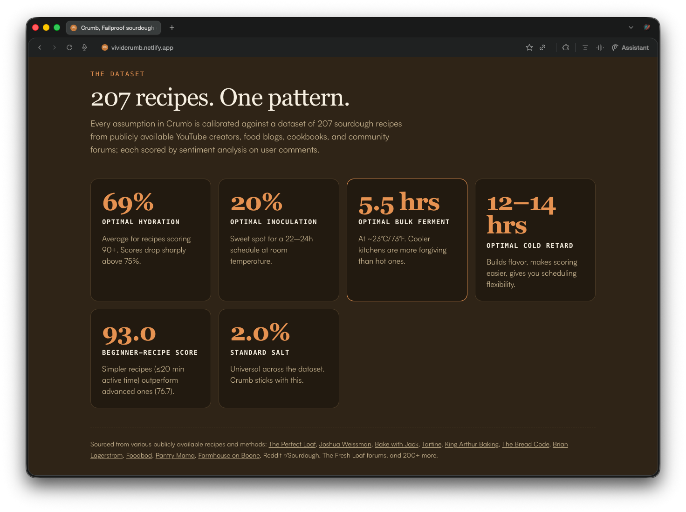

# Sourdough Intelligence / Crumb

A data-driven sourdough baking framework and scheduling calculator. Built for bakers who want a schedule that fits their day, not the other way around.

Live app: [vividcrumb.netlify.app](https://vividcrumb.netlify.app)

## Screenshots







---

## Background

This project started in 2018, before LLMs were part of anyone's toolkit.

The original goal was simple: figure out which sourdough recipe gave a first-time baker the highest probability of success on the first attempt. To do this, I built a two-stage model:

1. **Multiple linear regression** across key recipe variables: hydration, fermentation time, flour type, inoculation rate, fold count, and bulk temperature.
2. **Sentiment analysis on YouTube comments** (IBM Watson NLP) to cross-reference which recipes correlated most with beginner success, and which ones consistently produced frustration or failure.

The output was a ranked shortlist of top 3 beginner recipes. I picked one, baked it, and it worked first try.

No LLMs. No fancy stack. Just R, IBM Watson NLP, and a probably unhealthy amount of time reading bread forums.

---

## The Product

Crumb turns that research into an interactive browser app. Instead of asking a baker to follow a fixed recipe schedule, it asks:

- What are you baking?
- When do you want it out of the oven?
- How much active handling time do you have?
- How warm is your kitchen?
- What flour and skill level are we designing around?

The app then generates a practical formula, ingredient list, and timestamped schedule that fit those constraints.

### Product Highlights

- Multi-step bake wizard for bread type, timing, active-time budget, kitchen temperature, flour, skill level, and loaf size.
- Seven bread archetypes: sandwich loaf, toast loaf, country loaf, rolls, pizza dough, focaccia, and baguette.
- Recipe formula generation using baker's percentages for flour, water, starter, salt, and enrichments.
- Schedule engine that works backwards from the target finish time.
- Active-step planning with quiet-hours support so folds and shaping do not land during sleep or work blocks.
- Temperature-aware bulk fermentation estimate.
- Warnings for unrealistic timelines, risky hydration, hot kitchens, and active-time mismatches.
- Printable plan and PNG export for saving the generated bake schedule.
- Light and dark themes, responsive layout, and dependency-light static deployment.

---

## The Dataset

The framework is built on a private **207 sourdough recipe analysis** sourced from public YouTube creators, food blogs, cookbooks, and community forums including:

- The Perfect Loaf, Joshua Weissman, Bake with Jack, Tartine, King Arthur Baking
- The Bread Code, Brian Lagerstrom, Foodbod, Pantry Mama, Farmhouse on Boone
- Reddit r/Sourdough, The Fresh Loaf forums, and additional public community sources

Each recipe was scored using sentiment analysis on user feedback and normalized across key recipe variables. Key findings from the analysis:

| Variable | Optimal Value | Notes |
|---|---:|---|
| Hydration | 69% | Scores drop sharply above 75% |
| Inoculation | 20% | Sweet spot for a 22-24h room temp schedule |
| Bulk ferment | 5.5 hrs | At ~23°C / 73°F |
| Cold retard | 12-14 hrs | Builds flavour, adds scheduling flexibility |
| Beginner recipe score | 93.0 | Simple recipes (<=20 min active) vs advanced (76.7) |
| Salt | 2.0% | Common standard across the dataset |

**Median failproof score across the full dataset: 92.4**

The raw dataset is intentionally not included in this repository because it contains derived observations from third-party recipe sources and community content. The public methodology is documented in [METHODOLOGY.md](./METHODOLOGY.md).

---

## How the Calculator Works

Most recipes hand you a fixed schedule and hope it fits your day. This calculator does the opposite.

You input:

- What you want to bake and when you want it out of the oven
- How much active time you have to handle the dough
- Your kitchen temperature and flour type
- Your skill level

The calculator works backwards from your finish time, selecting hydration, fold count, inoculation rate, and fermentation length to maximise your chance of a successful loaf.

### The six-step logic

1. **Pick a process archetype** - Sandwich, open-crumb, focaccia, pizza: each has its own hydration window, salt level, and shaping style.
2. **Match folds to your time** - 20 minutes? No folds, vigorous initial mix. An hour? Classic 3-fold pattern. Never more touch points than you can actually do.
3. **Set inoculation by timeline** - Short schedule = more starter (faster ferment). Long retard = less starter (controlled ferment). Pulled from a regime table validated against the analysis.
4. **Predict bulk from temperature** - Q10 ~= 2: every 10°C swing roughly doubles or halves fermentation rate. Bulk hours are computed from dough temperature and inoculation, not from a fixed timer.
5. **Stay in the failproof zone** - The analysis shows scores drop sharply above 75% hydration and below 18°C bulk temp. Hydration and timing are capped and adjusted based on skill level.
6. **Render a real schedule** - Timestamped touch-points fitted to your actual day. Every step is labelled active or passive, with sensory cues so you know what to look for.

---

## Recent Work

The framework was recently expanded using **NVIDIA Nemotron 3 Super** to process the broader recipe dataset and refine scoring logic. The core regression model and sentiment cross-reference methodology remain the same; the newer model accelerated analysis at scale.

---

## Tech Stack

| Layer | Tools |
|---|---|
| Original modelling (2018) | R, IBM Watson NLP |
| Dataset expansion | NVIDIA Nemotron 3 Super |
| Frontend calculator | HTML, CSS, vanilla JavaScript modules |
| Export utility | html2canvas |
| Hosting | Netlify |

No framework or build step is required.

---

## Repository Structure

```text
sourdough-intelligence/
├── index.html       # Static app shell and wizard markup
├── styles.css       # Responsive visual system, themes, print styles
├── app.js           # UI state, event handling, rendering
├── engine.js        # Pure planning, formula, and schedule logic
├── screenshots/     # Portfolio screenshots used in this README
├── METHODOLOGY.md   # Public explanation of the recipe analysis and heuristics
├── LICENSE          # MIT license
└── README.md        # Portfolio overview
```

---

## Run Locally

Because the app uses ES modules, serve the folder with a local static server:

```bash
python3 -m http.server 5173
```

Then open:

```text
http://localhost:5173
```

---

## Engineering Notes

The engine is deliberately separated from the DOM. `engine.js` exposes pure functions such as `generatePlan`, `buildFormula`, and `computeBulkHours`, while `app.js` owns UI state and rendering. This keeps the core baking logic easier to inspect, test, and iterate without coupling it to the page.

The most important design decision was to treat sourdough as a constrained scheduling system. Hydration, inoculation, fold count, fermentation length, cold retard, and warnings are all selected in response to user constraints instead of being hard-coded as a single recipe.

---

## Data Privacy

This repository does not include:

- Raw recipe rows
- Scraped comments or third-party text
- Private notes
- API keys or environment secrets

Only aggregate assumptions, methodology, and implementation logic are shared.

---

## License

MIT

---

Built with love for baking by [Vivid Sourdough](https://www.instagram.com/vividsourdough/)
